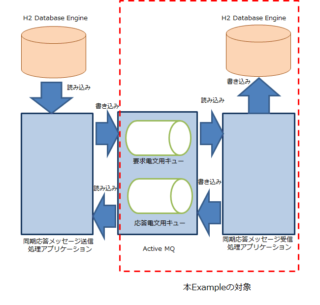

nablarch-example-mom-sync-receive
====================================

Nablarch FrameworkのMOM同期応答メッセージングの受信側のExampleです。
MOM同期応答メッセージングの送信側のExampleと組み合わせて使用します。

以下にメッセージングのシステムのうち、本Exampleが対象とする箇所を示します。



## 実行手順

### 1.動作環境
実行環境に以下のソフトウェアがインストールされている事を前提とします。
* Java Version : 17
* Maven 3.9.9以降

補足：
MOMとRDBMSはExampleに組み込まれたものを使用します。

### 2. プロジェクトリポジトリの取得
Gitを使用している場合、アプリケーションを配置したいディレクトリにて「git clone」コマンドを実行してください。
以下、コマンドの例です。

    $mkdir c:\example
    $cd c:\example
    $git clone https://github.com/nablarch/nablarch-example-mom-testing-common.git
    $git clone https://github.com/nablarch/nablarch-example-mom-sync-receive.git

Gitを使用しない場合、最新のタグからzipをダウンロードし、任意のディレクトリへ展開してください。

### 3. アプリケーションのビルド
#### 3.1. 動作確認用モジュールのビルド
まず、nablarch-example-mom-testing-commonをビルドします。

    $cd nablarch-example-mom-testing-common
    $mvn clean install

#### 3.2. アプリケーションのビルド
次に、nablarch-example-mom-sync-receiveをビルドします。以下のコマンドを実行してください。

    $cd ../nablarch-example-mom-sync-receive
    $mvn package

※Windowsのコマンドプロンプトから実行した際にVMがクラッシュする場合は `mvn package > log-file.log` のようにログ出力をリダイレクトしてください。

実行に成功すると、以下のようなログがコンソールに出力されます。

    (中略)
    [INFO] ------------------------------------------------------------------------
    [INFO] BUILD SUCCESS
    [INFO] ------------------------------------------------------------------------
    (中略)

#### コマンドの補足
本Exampleアプリケーションを起動するまでに必要な手順は以下になります。

1. データベースのセットアップ及びエンティティクラスの作成
1. アプリケーションのビルド

これらの手順は`package`を実行する際にすべて含まれていますが、個別に実行することもできます。

##### データベースのセットアップ及びエンティティクラスの作成

以下のコマンドを実行することでデータベースのセットアップ及びエンティティクラスの作成を行うことができます。

    $mvn generate-resources

※gspプラグインをJava 17で実行するためにはJVMオプションの指定が必要ですが、そのオプションは`.mvn/jvm.config`で指定しています。

##### アプリケーションのビルド

以下のコマンドを実行することでアプリケーションのビルドを行うことができます。

    $mvn compile

※`compile`を実行するとデータベースのセットアップ及びエンティティクラスの作成処理も行われます。


### 4. アプリケーションの起動

以下のコマンドで、データベースの状態を最新化、MOM同期応答メッセージングの受信側のExampleが起動します。

    $mvn generate-resources
    $mvn exec:java -Dexec.mainClass=nablarch.fw.launcher.Main -Dexec.args="'-diConfig' 'classpath:messaging-sync-receive-boot.xml' '-requestPath' 'RECEIVEAPP' '-userId' 'batch_user'"

なお、 `maven-assembly-plugin` を使用して実行可能jarの生成を行っているため、以下の手順にて実行することもできる。

1. ``target/application-<version_no>.zip`` を任意のディレクトリに解凍する。
2. 以下のコマンドにて実行する

  ```
      java -jar <1で解凍したディレクトリ名>/nablarch-example-mom-sync-receive-<version_no>.jar -diConfig classpath:messaging-sync-receive-boot.xml -requestPath RECEIVEAPP -userId batch_user
  ```

起動に成功すると以下のようなログがコンソールに出力され、MOM同期応答メッセージングの送信側からのメッセージの受信待ちの状態になります。

```log
2023-02-15 13:28:17.362 -INFO- nablarch.fw.launcher.Main [null] boot_proc = [] proc_sys = [mom-sync-receive] req_id
= [null] usr_id = [null] @@@@ APPLICATION SETTINGS @@@@
        system settings = {
        }
        business date = [20140123]
```

MOM同期応答メッセージングの送信側を起動すると、MOM同期応答メッセージングの受信側のコンソールに以下のように、メッセージを受信したことと、メッセージを返信したことを示すログが出力されます。
(コンソール中の文字が化けるのは仕様です。)

```log
2023-02-15 13:30:09.178 -INFO- MESSAGING [202302151328173640001] boot_proc = [] proc_sys = [mom-sync-receive] req_id
 = [RECEIVEAPP] usr_id = [batch_user] @@@@ RECEIVED MESSAGE @@@@
        thread_name    = [pool-1-thread-1]
        message_id     = [ID:6e02d455-ace9-11ed-bf95-9c7befbbf589]
        destination    = [TEST.REQUEST]
        correlation_id = [null]
        reply_to       = [TEST.RESPONSE]
        message_body   = [ProjectInsertMessage0
?v???W?F?N?g?O?O?P

                        development
                                    s
                                                20100918201504091        ????

                                                                                                 ????


     100      ???l??


                                                                                                              10000
   1000     2000     3000
]
(中略)
2023-02-15 13:30:09.602 -INFO- MESSAGING [202302151330092260002] boot_proc = [] proc_sys = [mom-sync-receive] req_id
 = [ProjectInsertMessage] usr_id = [batch_user] @@@@ SENT MESSAGE @@@@
        thread_name    = [pool-1-thread-1]
        message_id     = [ID:6e481b72-ace9-11ed-8a28-9c7befbbf589]
        destination    = [TEST.RESPONSE]
        correlation_id = [ID:6e02d455-ace9-11ed-bf95-9c7befbbf589]
        reply_to       = [null]
        time_to_live   = [0]
        message_body   = [ProjectInsertMessage0
success
]
```


自動的に終了はしないため、ctrl + c等で終了させてください。

### 5. DBの確認方法

1. https://www.h2database.com/html/download.html からH2をインストールしてください。  

2. {インストールフォルダ}/bin/h2.bat を実行してください(コマンドプロンプトが開く)。  
  ※h2.bat実行中はExampleアプリケーションからDBへアクセスすることができないため、Exampleアプリケーションを停止しておいてください。

3. ブラウザから http://localhost:8082 を開き、以下の情報でH2コンソールにログインしてください。
   JDBC URLの{dbファイルのパス}には、`SAMPLE.h2.db`ファイルの格納ディレクトリまでのパスを指定してください。  
  JDBC URL：jdbc:h2:{dbファイルのパス}/SAMPLE  
  ユーザ名：SAMPLE  
  パスワード：SAMPLE
